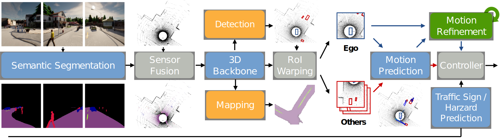

# LAV

> [**Learning from All Vehicles**](https://dotchen.github.io/LAV/)    
> Dian Chen, Philipp Kr&auml;henb&uuml;hl         
> _CVPR 2022_ (also [arXiV 2203.11934](http://arxiv.org/abs/2203.11934))

[](https://paperswithcode.com/sota/autonomous-driving-on-carla-leaderboard?p=learning-from-all-vehicles)

This repo contains code for paper [Learning from all vehicles](http://arxiv.org/abs/2203.11934).

It distills a model that performs joint perception, multi-modal prediction and planning, and we hope it to be a great starter kit for end-to-end autonomous driving research.

## Reference
If you find our repo, dataset or paper useful, please cite us as
```bibtex
@inproceedings{chen2022lav,
  title={Learning from all vehicles},
  author={Chen, Dian and Kr{\"a}henb{\"u}hl, Philipp},
  booktitle={CVPR},
  year={2022}
}
```

## Updates
* We have slightly updated codes optimized for leaderboard inference speed. Full codes will be released soon.

## Demo Video
[](https://www.youtube.com/watch?v=-TlxbmSQ7rQ)

Also checkout our [website](https://dotchen.github.io/LAV/)!

## Getting Started
* To run CARLA and train the models, make sure you are using a machine with **at least** a mid-end GPU.
* Please follow [INSTALL.md](docs/INSTALL.md) to setup the environment.

## Training
We adopt a LBC-style staged privileged distillation framework.
Please refer to [TRAINING.md](docs/TRAINING.md) for more details.

## Evaluation
We additionally provide examplery trained weights in the `weights` folder if you would like to directly evaluate.
They are trained on Town01, 03, 04, 06.
Make sure you are launching CARLA with the `-vulkan` flag.

**Note**: Please note that this is just example weights for quickstart purposes. 
If you directly submit this to leaderboard you will not get 61 DS.
Full leaderboard codes will be released later.

Inside the root LAV repo, run
```bash
ROUTES=[PATH TO ROUTES] ./leaderboard/scripts/run_evaluation.sh
```
Use `ROUTES=assets/routes_lav_valid.xml` to run our ablation routes, or `ROUTES=leaderboard/data/routes_valid.xml` for the validation routes provided by leaderboard.

## Dataset
We also release our LAV dataset. Download the dataset [HERE](https://utexas.box.com/s/evo96v5md4r8nooma3z17kcnfjzp2wed).

See [TRAINING.md](docs/TRAINING.md) for more details.

## Acknowledgements
We thank Tianwei Yin for the pillar generation code.
The ERFNet codes are taken from the official ERFNet repo.

## License
This repo is released under the Apache 2.0 License (please refer to the LICENSE file for details).
