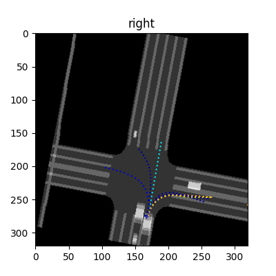
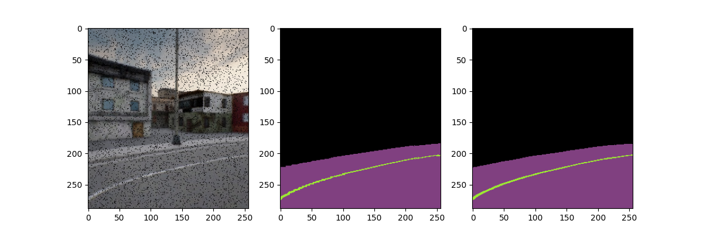
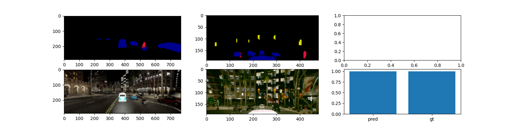
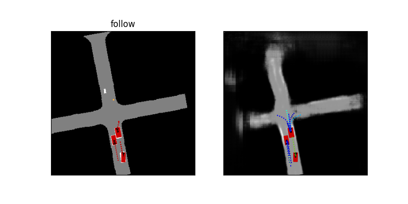

# Training LAV

We use a LBC-style privileged distillation framework. Please follow the instructions below for different training stages.

Make sure you have followed [INSTALL,md](./INSTALL.md) before proceeding.

All steps will visualize and store weights to the `wandb` cloud (locally as well), so make sure you have it setup already.

For all following training stages, you need a multi-GPU machine or should otherwise decrease the batch size.

## Dataset
First, download the [LAV dataset](https://utexas.box.com/s/evo96v5md4r8nooma3z17kcnfjzp2wed).

We have released the full 3425 trajectories. However, each trajectory is self-contained, and you may only download a subset of them to run the training code.
After downloading the dataset, specify the dataset path in the following line of `config.yaml`:

```yaml
data_dir: [PATH tO DATASET]
```

## Privileged Motion Planning
```bash
python -m lav.train_bev
```
You can monitor the training and visualize the progess in your wandb page of project `lav_bev`:



## Semantic Segmentation
```bash
python -m lav.train_seg
```
Similar, monitor the progess in wandb of `lav_seg`:



## RGB Braking Prediction
```bash
python -m lav.train_bra
```
You can monitor the training and visualize the progess in your wandb page of project `lav_bra`:



## Point Painting
Write painted lidar points to the disk.

```bash
python -m lav.data_paint
```

## Full Models
This is divided into two steps.
### Perception Pre-training
```bash
python -m lav.train_full --perceive-only
```
Once it is done, update the following lines in `config.yaml`:

```yaml
lidar_model_dir: [TRAINED MODEL PATH]
```

### End-to-end Training
```bash
python -m lav.train_full
```

Visualize the progress in wandb project page `lav_full`:


